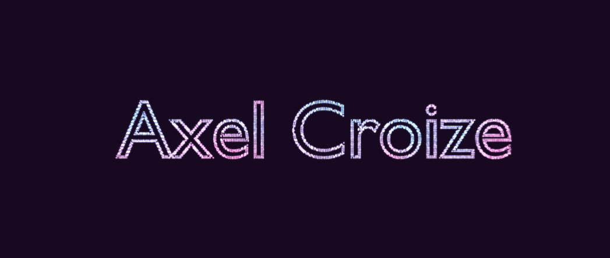
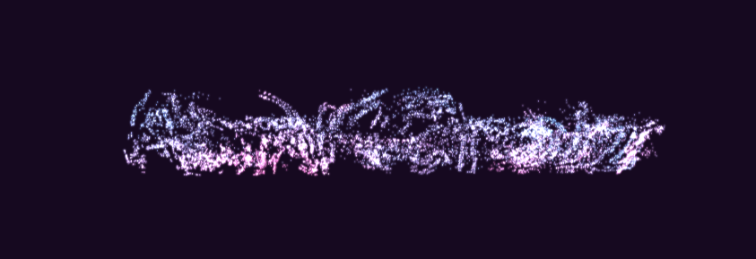

# Three.js Text Particles Transtions

## Screenshots





## Live Demo

[Go to demo](https://tolexia.github.io/three_particle_transitions/)

## Setup
Download [Node.js](https://nodejs.org/en/download/).
Run this followed commands:

``` bash
# Install dependencies (only the first time)
npm install

# Run the local server at localhost:8080
npm run dev

# Build for production in the dist/ directory
npm run build
```
